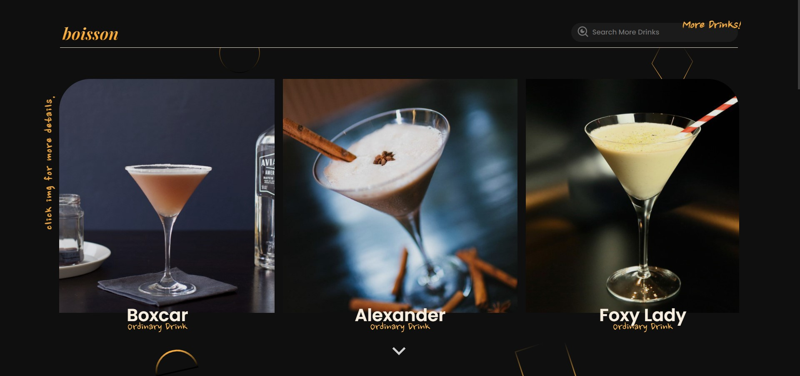

  <h2 align="center"> <a href="https://boisson.vercel.app" target="_blank">Boisson 🍸</a></h2>
  

    A Collective List of Cocktails and other Drinks!
     
    <a href="https://www.thecocktaildb.com/api.php" target="_blank"><strong>Powered by TheCocktailDB »</strong></a>
     
     
    <a href="https://boisson.vercel.app">Visit Site</a>
    ·
    <a href="https://github.com/hyamero/boisson-ctdb/issues">Report Bug</a>
    ·
    <a href="https://dsc.bio/dale" target="_blank">Discord</a>
  

### Built With
- `React.js`
- `Emotion.sh`
- `Framer Motion`
- `React Router`
- `React Icons`
- `Axios`
- `AOS`

<!-- LICENSE -->
## License

Distributed under the MIT License. See `LICENSE` for more information.

<!-- MARKDOWN LINKS & IMAGES -->
<!-- https://www.markdownguide.org/basic-syntax/#reference-style-links -->
[contributors-shield]: https://img.shields.io/github/contributors/hyamero/boisson-ctdb.svg?style=for-the-badge
[contributors-url]: https://github.com/hyamero/boisson-ctdb/graphs/contributors
[forks-shield]: https://img.shields.io/github/forks/othneildrew/Best-README-Template.svg?style=for-the-badge
[forks-url]: https://github.com/hyamero/boisson-ctdb/network/members
[stars-shield]: https://img.shields.io/github/stars/othneildrew/Best-README-Template.svg?style=for-the-badge
[stars-url]: https://github.com/hyamero/boisson-ctdb/stargazers
[issues-shield]: https://img.shields.io/github/issues/othneildrew/Best-README-Template.svg?style=for-the-badge
[issues-url]: https://github.com/hyamero/boisson-ctdb/issues
[license-shield]: https://img.shields.io/github/license/othneildrew/Best-README-Template.svg?style=for-the-badge
[license-url]: https://github.com/hyamero/boisson-ctdb/blob/master/LICENSE.txt
[linkedin-shield]: https://img.shields.io/badge/-LinkedIn-black.svg?style=for-the-badge&logo=linkedin&colorB=555
[linkedin-url]: https://linkedin.com/in/othneildrew
[product-screenshot]: images/screenshot.png

## 🤝 Support

Contributions, issues, and feature requests are welcome!

Give a ⭐️ if you like this project!
